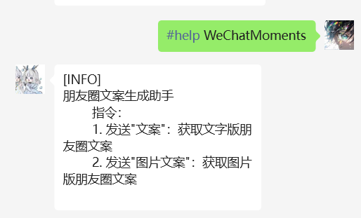
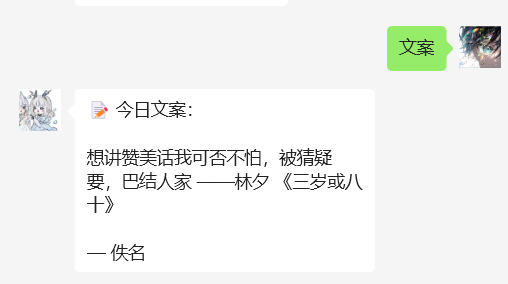
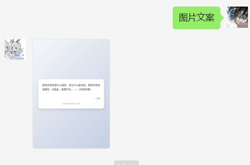

# WeChatMoments
WeChatMoments 是一款适用于 chatgpt-on-wechat 项目的朋友圈文案生成插件，调用天聚数行的 API 接口，支持生成文字版和图片版的朋友圈文案。

## 一. 安装必需环境
1. 安装 playwright：`pip install playwright`
2. 安装 chromium：`playwright install chromium`
3. 安装字体：解压 Fonts.rar 到系统字体目录

## 二. 获取 TIAN_API_KEY
1. 注册登录天聚数行 API：https://www.tianapi.com
2. 在控制台获取 APIKEY
3. 申请"朋友圈文案"接口，每天免费 100 次调用

## 三. 安装配置
1. 安装插件：`#installp https://github.com/[YourUsername]/WeChatMoments.git`
2. 配置 config.json 中的 TIAN_API_KEY
3. 重启项目并扫描插件：`#scanp`

## 四. 使用指令
- 发送"文案"：获取文字版朋友圈文案
- 发送"图片文案"：获取图片版朋友圈文案

## 五. 使用样例

